# Step by step to install Windows 11 inside qemu using arch/manjaro linux as host OS

(assuming you are using `yay` as AUR client of pacman)

### Install QEMU and GUI client

```SH
yay -S qemu virt-manager
```

Configure user to `run as`

```SH
sudo vim /etc/libvirt/qemu.conf
```

find and set vars inside

```SH
user = "root"

group = "root"
```


### Install additionals for TPM emulation/passthrough and secure boot

```SH
yay -S edk2-ovmf 
```

find and edit `nvram` variable as below in

```SH
sudo vim /etc/libvirt/qemu.conf
```

```SH

nvram = [
   "/usr/share/OVMF/x64/OVMF_CODE.fd:/usr/share/OVMF/x64/OVMF_VARS.fd",
   "/usr/share/OVMF/x64/OVMF_CODE.secboot.fd:/usr/share/OVMF/x64/OVMF_VARS.fd"
]

```

### Some hacks to make `ofmv` (select chipset, efi and secure boot) working

```SH
sudo mv /usr/share/qemu/firmware /usr/share/qemu/firmware-old
```

## Everything is ready to create our VM

Open virt manager, then click + to open VM creation wizard 

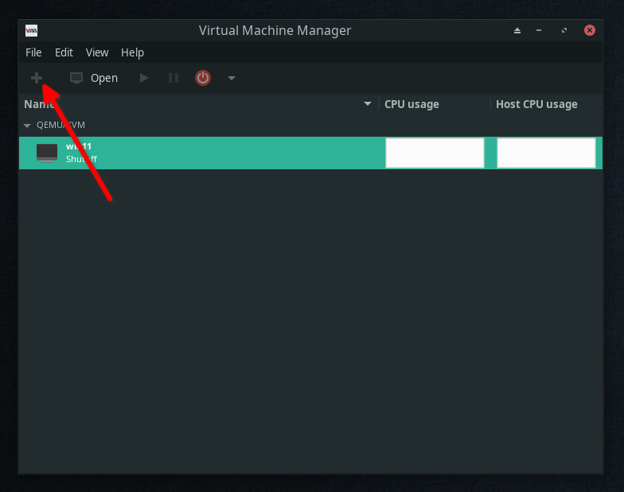

We are going to perform offline/local installation, ensure architecture selected as below

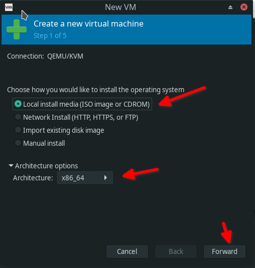

- select the OS image we are going to install from

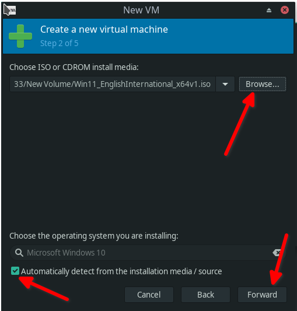

- select RAM and CPU values

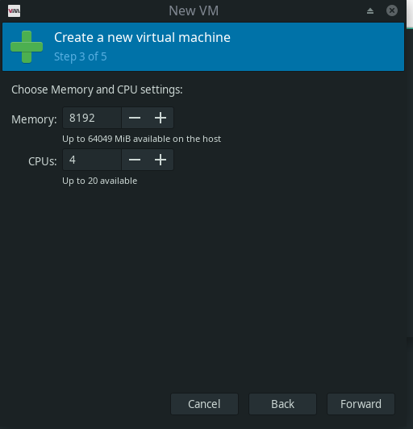


- create drive image

   ```SH 
   qemu-img create -f raw /path/to/image/drive_image_name 80G
   ```

- then select it inside wizard  

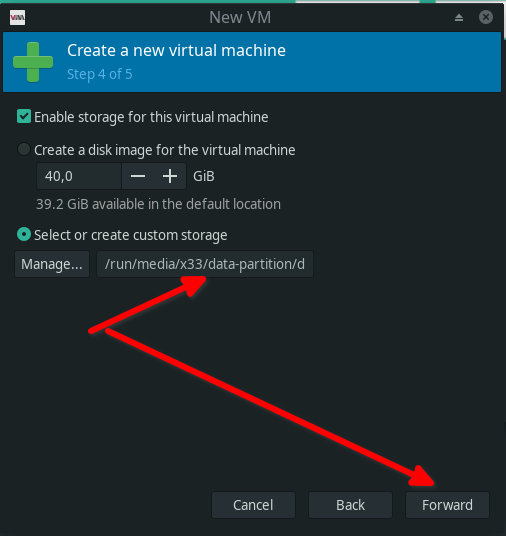

- choose VM name
- ensure you have choosen correct drive for future VM
- check `customize before install`


- select the network passthrough type and device (virbr0 in our case)
   - find your network bridge 
      ```SH
      brctl show
      ```

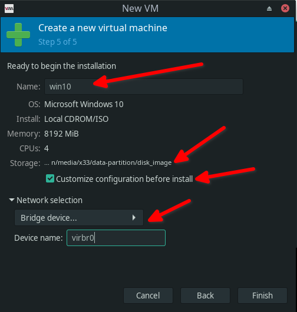

- after you clicked `finish` the configuration before installation will be opened
- **ensure everything are like on the screenshoots as below**

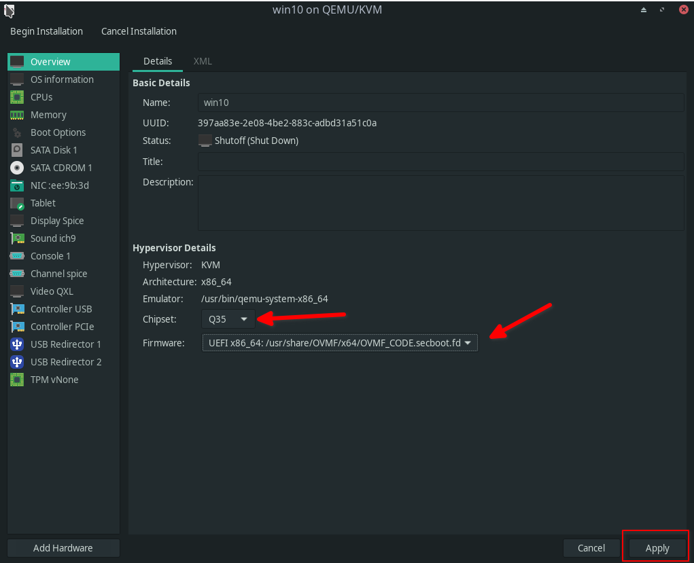
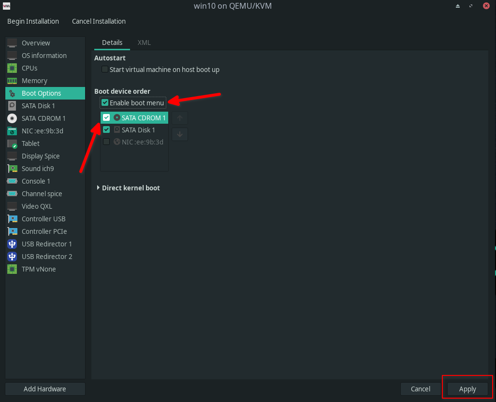

- these options will give you smooth feeling of GUI rendering inside VM, but still not enough to play games:

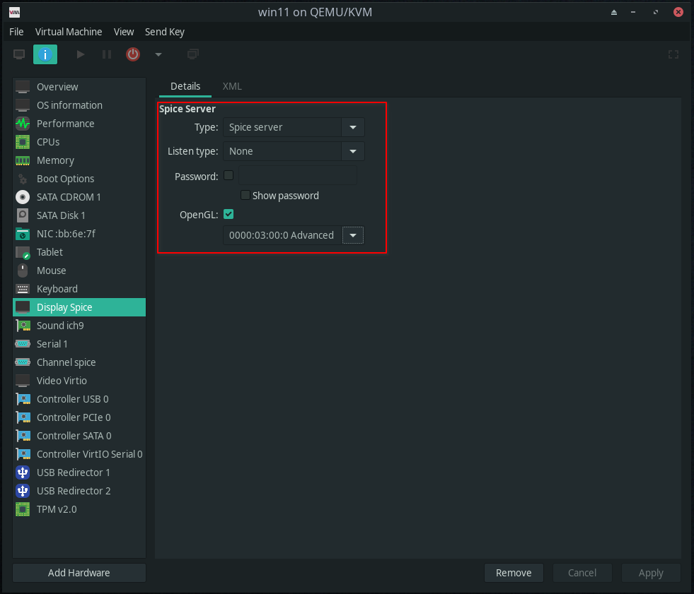
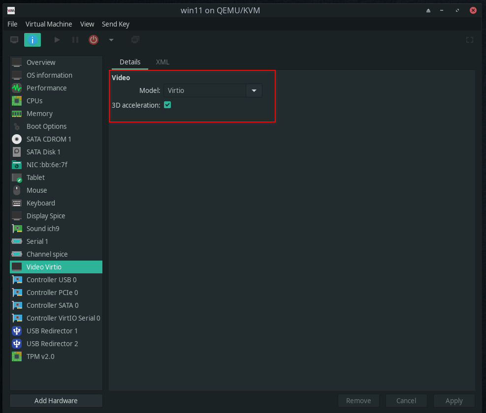

- then the last thing you should add TPM 2.0 emulation to your VM

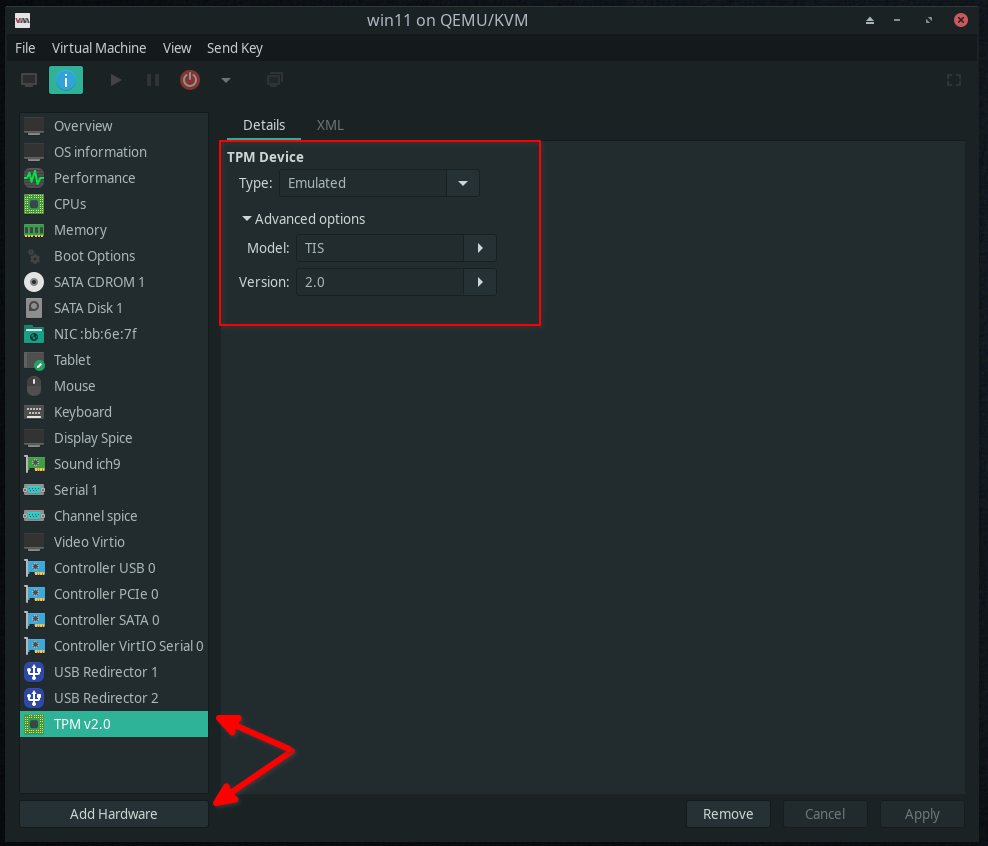

### Setup screen resolution

- during start of the bios spam f2 and wait untill `bios` menu appeared
- goto `Device Manager`
- goto `OVMF Platform Configuration`
- find `Change Preferred Resolution for Next Boot`
- select preferred, then `Commit Changes and Exit`

### Usefull shortcuts of virt-manager viewer

foreground mouse to host OS - `Ctrl_L+Alt_L`

show toolbar in fullscreen mode - `Ctrl_L+Alt_L+f`


